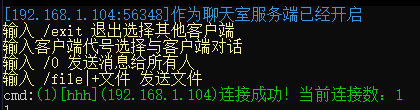

# MAIN
C++套接字，多线程同步
#### 介绍
实现聊天室，小文件传输

#### 软件架构
套接字经典架构

#### 安装教程

gcc编译是需要加上-lwsock32编译参数

#### 使用说明

1.  如图
  
2.  注意，服务端发送的在客户端那边是接收的cmd命令，可能会有误差
3.  q群:820146120
#### 参与贡献

1.  这里要感谢b站 百度 github gitee

